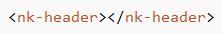
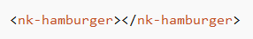
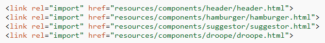

# Web Components

We have created a project to illustrate web components. 
>Web Components are a set of standards currently being produced by Google engineers as a W3C specification that allows you to create reusable widgets or components in web documents and web applications.

To run the project, follow the below mentioned steps:
```
1) Take git clone of the following link on your system.
        (http://gitlab.infoedge.com/hackathon4.0/webComponents.git)
2) Open the folden 'src > resources'
3) From this folder, open the file 'index.html' in your browser.
```
##### Note: Product should be run on localhost

### Web Components come up with some interesting features:
- Define new HTML/DOM elements
- Create elements that extend from other elements
- Logically bundle together custom functionality into a single tag
- Extend the API of existing DOM elements


*Web Components is a set of cutting edge standards that:*
- *Make it possible to build widgets*
- *…which can be reused reliably*
- *…and which won’t break pages if the next version of the component changes internal implementation details.*

### Web Components consist of 4 main elements:
- Custom Elements
- Shadow DOM
- HTML Imports
- HTML Templates


### Custom Elements
Custom Elements allow web developers to define new types of HTML elements and even help you custom the newly created DOM element.


We just need to register the element and use it in our web application.


In our project we have used custom elements for:
- Header of our page

- Drawer

- Suggestor

- Droope


### Shadow DOM

Shadow DOM addresses the DOM tree encapsulation problem.
With Shadow DOM, elements can get a new kind of node associated with them. This new kind of node is called a shadow root. An element that has a shadow root associated with it is called a shadow host. The content of a shadow host isn’t rendered; the content of the shadow root is rendered instead.


### HTML Import
HTML Imports, part of the Web Components cast, is a way to include HTML documents in other HTML documents. You're not limited to markup either. An import can also include CSS, JavaScript, or anything else an html file can contains.


### HTML Template
The concept of templating is not new to web development.
The HTML <template> element represents a template in your markup. It contains "template contents", which acts as pieces of scaffolding that you can use (and reuse) throughout the lifetime of your app.

To create a templated content, declare some markup and wrap it in the <template> element.


### References:
Custom element : http://www.html5rocks.com/en/tutorials/webcomponents/customelements/

Shadow dom: http://www.html5rocks.com/en/tutorials/webcomponents/shadowdom/

Template: http://www.html5rocks.com/en/tutorials/webcomponents/template/

Html import: http://www.html5rocks.com/en/tutorials/webcomponents/imports/
